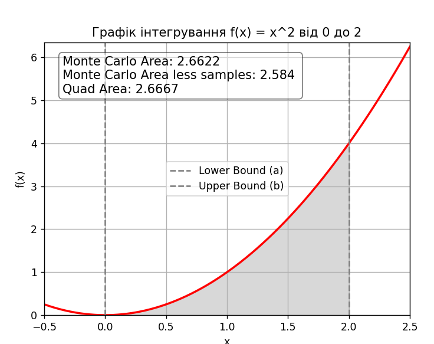

# goit-algo-hw-10
Home work 10 Algorithms | Linear programming and randomized algorithms

Висновки:

Метод Монте-Карло є потужним інструментом для оцінки інтегралів, особливо в складних випадках, коли аналітичне інтегрування є ускладненим або неможливим.
Однак, для більшої точності необхідно використовувати достатню кількість зразків.